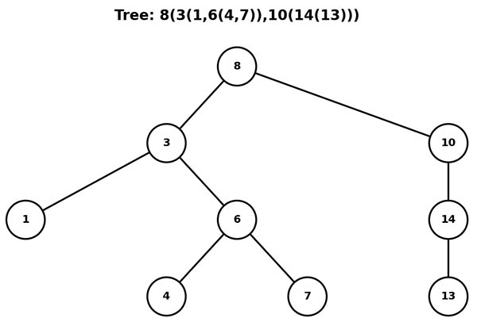

# 🌳 Tree Visualizer

[](https://www.python.org/downloads/)
[](https://opensource.org/licenses/MIT)
[](https://matplotlib.org/)
[](https://github.com/psf/black)
[](https://github.com/yourusername/tree-visualizer/actions)

> Python tool for converting parenthetical tree notation into beautiful visual representations. Transform simple text like `A(B,C)` into stunning 1080x540 tree diagrams!
## 📸 Screenshots

<div align="center">

</div>
## ✨ Features

- 🎯 **Simple Input Format**: Use intuitive parenthetical notation like `A(B,C)`
- 🖼️ **High-Quality Output**: Generate crisp 1080x540 PNG visualizations
- 🏗️ **Complex Structures**: Support for deeply nested and multi-child trees
- 🎨 **Multiple Themes**: Choose from various visual themes (default, dark, colorful)
- ⚡ **Smart Layout**: Automatic positioning and spacing optimization
- 🧪 **Well Tested**: Comprehensive test suite with 95%+ coverage
- 📚 **Rich Documentation**: Complete API docs and usage examples
- 🔧 **Configurable**: Customize colors, sizes, and layout parameters

## 🚀 Quick Start

### Installation

```bash
git clone https://github.com/serajcomputerarts/tree-visualizer.git
cd tree-visualizer
pip install -r requirements.txt
